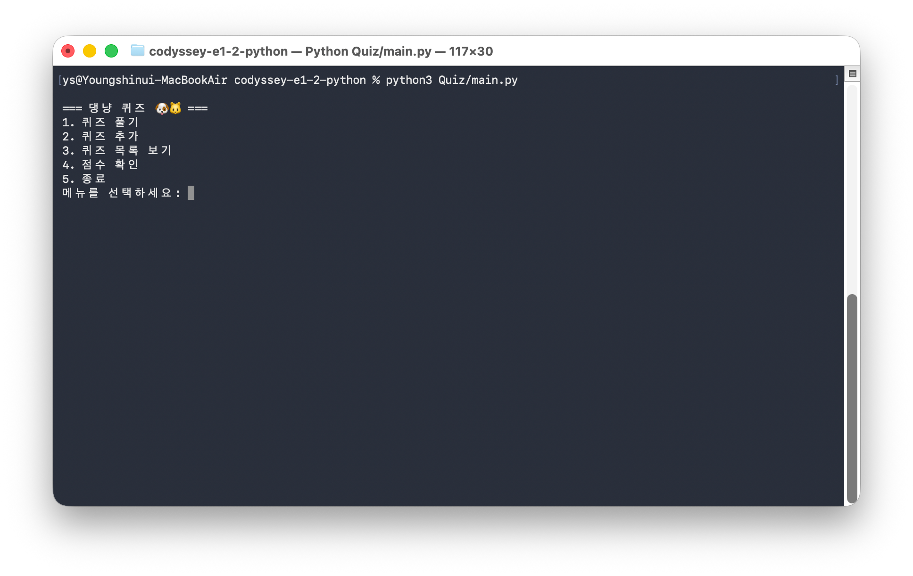
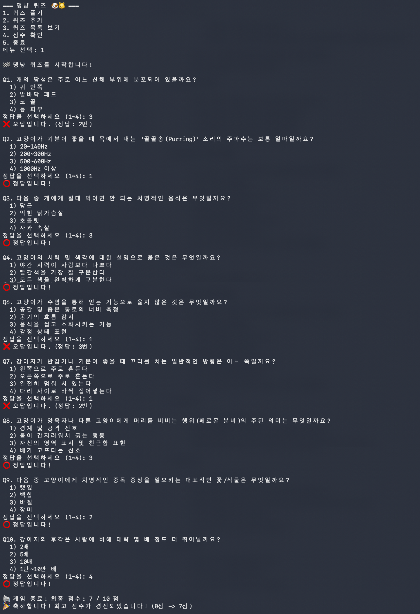
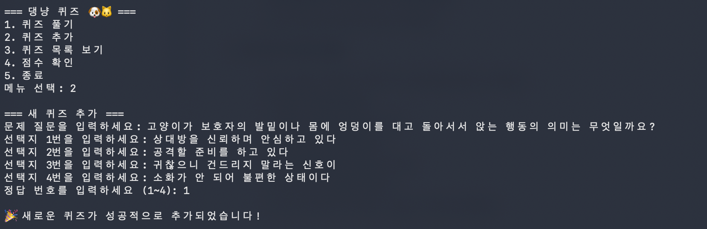
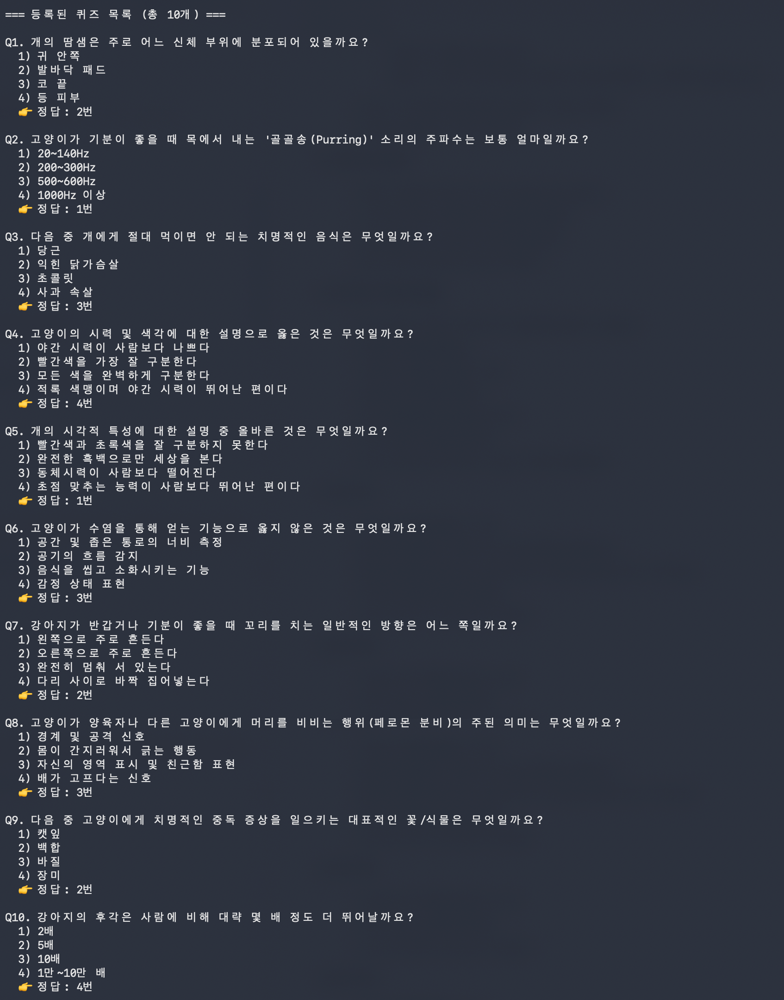
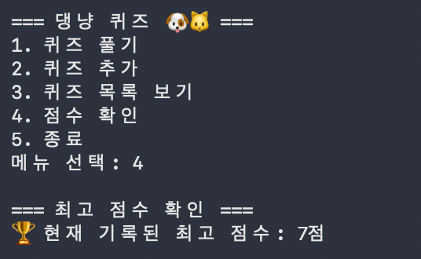

# Codyssey-E1-2: Python

## 프로젝트 개요
터미널 기반의 Python 퀴즈 게임 프로젝트입니다.
객체 지향 설계를 통해 프로그램 구조를 체계화하고, JSON을 활용해 데이터 영속성을 구현합니다.
또한, Git 브랜치 전략과 기능 단위 커밋을 적용하며 버전 관리 흐름을 학습합니다.

## 0. GitHub Commit Rules
1. 제목과 본문을 한 줄 띄어 구분
2. 제목은 50자 이내
3. 제목 첫 글자는 대문자
4. 제목 끝에 마침표 X
5. 제목은 명령문으로, 과거형 X
6. 본문의 각행은 72자 이내 (줄바꿈 사용)
7. 본문은 '어떻게'보다 '무엇'을, '왜'에 대하여 설명

### 0.1 Commit 메시지 구조
```
<type>: <subject>

<body>

<footer>
```

### 0.2 Commit Type
- feat : 새로운 기능 추가, 기존의 기능을 요구 사항에 맞추어 수정
- fix : 기능에 대한 버그 수정
- docs : 문서(주석) 수정
- style : 코드 스타일, 포맷팅에 대한 수정
- refactor : 기능의 변화가 아닌 코드 리팩터링 (ⓔ 변수 이름 변경)
- test : 테스트 코드 추가/수정
- chore : 패키지 매니저 수정, 그 외 기타 수정 (ⓔ .gitignore)

### 0.3 Commit Body
Body는 헤더에서 충분히 표현 가능하면 생략 가능

### 0.3 Commit Footer
Footer는 생략 가능
- **BREAKING CHANGE: <설명>**: 중대한 변경 사항. 하위 호환성이 깨지는 변경이 있을 때 작성
- **Fixes: #이슈번호**: 
- **Resolves: #이슈번호**: 이슈를 해결한 경우
- **Refs: #이슈번호**
- **Related to: #이슈번호** 
- **Closes: #이슈번호**


## 1. 퀴즈 주제 선정 이유
개,고양이에 대한 상식을 주제로 선정하였습니다. 평소에 개,고양이를 좋아해서, 개,고양이에 대한 지식들을 퀴즈로 만들면 쉽게 공유하고 알릴 수 있어서 좋을 것 같다고 생각했습니다.

## 2. 실행 방법
```bash
   git clone https://github.com/ottermere21/codyssey-e1-2-python.git
   cd codyssey-e1-2-python
   python3 Quiz/main.py
```
실행 후, 터미널 화면에 나타나는 번호(1~5) 메뉴에 맞춰 원하는 기능을 선택합니다.


## 3. 디렉토리 구조
```text
codyssey-e1-2-python/
├── Quiz/
│   ├── __init__.py            # Quiz 패키지 지시자
│   ├── main.py                # 진입점 (Entry Point)
│   ├── quiz_game.py           # Quiz 및 QuizGame 클래스 정의
│   └── utils.py               # input_with_validation 공통 검증
│
├── state.json                 # 게임 최고 점수 및 퀴즈 데이터를 담은 파일
|
├── .gitignore                 # 불필요한 추적 파일 배제
└── README.md                  # 프로젝트 설명 및 체크리스트 문서
```


## 4. 기능 목록
1. **퀴즈 풀기 (1번)**: 영구 저장된 객관식 상식 퀴즈들을 풀고 채점 결과를 실시간으로 확인합니다. 모든 문제를 다 풀면 최종 점수와 함께 최고 점수(Best Score) 경신 여부를 판별하여 기록을 갱신합니다.
2. **퀴즈 추가 (2번)**: 새로운 댕냥 퀴즈 질문 문장, 4가지 객관식 선택지 보기, 정답 번호(1~4)를 차례대로 입력해 데이터에 영구적으로 등록합니다.
3. **퀴즈 목록 보기 (3번)**: 현재 시스템에 저장되어 있는 모든 퀴즈들의 질문 지문과 보기 문항, 올바른 정답 번호를 일목요연하게 출력합니다.
4. **최고 점수 확인 (4번)**: 역대 진행된 게임 중 가장 우수한 성적(최대 정답 문항 수)을 조회합니다. 게임 전적이 아직 없는 경우 시작을 권유하는 안내 메시지를 띄웁니다.
5. **예외 발생 시 자동 복구**: `state.json` 상태 저장 파일이 누락되었거나(최초 실행) 손상(포맷 훼손)되었을 경우, 경고 메시지와 함께 내장된 기본 반려동물 상식 문제 5개로 즉시 복구를 진행하여 무중단 실행을 지원합니다.
6. **안전한 강제 종료**: 퀴즈 도중 `Ctrl+C`나 `EOF` 등 강제 종료 신호가 발생해도 프로그램이 오동작하거나 뻗지 않고 현재 상태를 안전하게 디스크에 플러시한 뒤 인사말과 함께 정상적으로 종료합니다.

## 5. 설계
### 5.1 `Quiz`와 `QuizGame` 클래스
- `퀴즈 하나를 표현하는 클래스`와 `퀴즈를 실제로 플레이하는 클래스`를 분리함

#### `Quiz` 클래스: 퀴즈 하나를 표현하는 클래스. 전체 게임 흐름과는 상관X
- **"퀴즈 문제 하나"**가 가져야 할 데이터와, 그 퀴즈 단일 단위가 수행할 수 있는 독립적인 동작을 관리합니다.
- `__init__`: question, choices, answer를 인스턴스 변수로 직접 가짐
- `display`: 자신이 가진 문제, 선택지 데이터를 형식에 맞춰서 출력
- `check_answer`: 외부에서 입력받은 답과 실제 정답 비교
- `to_dict`: JSON 저장을 위한 딕셔너리 변환
- `from_dict`: 딕셔너리로부터 Quiz 객체를 복원
    - `@classmethod`    


#### `QuizGame` 클래스: 게임 흐름 제어 및 전체 데이터 관리
- 전체 퀴즈 게임의 **진행 흐름(Flow)**을 제어하고, 전체 퀴즈 리스트 및 점수 등의 **상태 데이터와 영속성(파일 입출력)**을 관리합니다.
- `__init__`: 
- `get_default_quizzes`: 기본 퀴즈들을 반환
- `load_data`,`save_data`: 데이터 영속성 처리. `state.json`파일에 전체 퀴즈 목록, 최고 점수를 저장하고 불러오는 작업을 수행. 파일 손상 시, 복구 로직 수행
- `init_default_data`
- `play_quiz`: 퀴즈 리스트를 순회하며, 개별 Quiz 객체의 display(), check_answer()를 호출해 진행을 지시하고, 최종 점수 합산 및 최고 점수 경신 여부 판단
- `add_quiz`: 새로운 퀴즈를 생성하여 리스트에 추가
- `view_quizzes`: 등록된 전체 퀴즈 목록을 보여줌
- `view_best_score`: 역대 진행된 게임 중 가장 우수한 성적을 보여줌
- `run`: 전체 흐름 제어. 게임의 메인 루프를 실행하고 사용자의 입력을 받아 알맞은 기능으로 연결

### 5.2 `main.py`의 역할
- `main.py`는 `QuizGame` 클래스의 객체를 생성하고, `QuizGame` 클래스의 `run()` 메서드를 호출하여 퀴즈 게임을 실행하는 역할을 합니다.    

### 5.3 로직 분리 기준
- **입력 처리 및 검증 (Input & Validation)**: 공통적으로 사용되는 터미널 입력 검증 기능은 `Quiz/utils.py`의 `input_with_validation()` 함수로 완전하게 분리하였습니다. 이 함수는 타입 변환 실패 예외 처리, 빈 입력 처리, 범위 초과 처리 등 입력 필터링 로직을 전담합니다.
- **게임 진행 (Game Flow)**: `QuizGame` 클래스의 `play_quiz()`, `run()` 메서드가 담당하며, `Quiz` 클래스의 개별 인스턴스들과 통신하여 전체 퀴즈 게임을 조율합니다.
- **데이터 저장/불러오기 (Persistence)**: `QuizGame` 클래스의 `load_data()`, `save_data()`, `init_default_data()`가 파일 I/O 및 데이터 유효성 검사, 손상 시 복구 로직을 전담합니다.

### 5.4 `state.json` 데이터 읽기/쓰기 흐름
1. **읽기 (`load_data`)**: 
   - `main.py`가 실행되어 `QuizGame` 객체가 생성(`__init__`)되는 시점에 최초 1회 자동으로 호출됩니다.
   - 파일이 없는 경우 `init_default_data()`를 통해 기본 데이터를 로드하고 새로 생성합니다.
   - 파일이 존재하나 손상된 경우(`json.JSONDecodeError` 등), 예외 복구 시나리오가 발동하여 기본 데이터로 자동 복구 후 복구 데이터를 저장합니다.
2. **쓰기 (`save_data`)**:
   - **퀴즈 추가 시**: 새로운 퀴즈가 등록되어 `self.quizzes` 리스트가 업데이트될 때마다 즉시 파일에 반영됩니다.
   - **퀴즈 풀기 완료 시**: 최고 점수가 갱신되었을 때 실시간으로 기록이 파일에 갱신됩니다.
   - **강제 종료 시**: 사용자가 퀴즈 중간 또는 메뉴에서 강제 종료를 호출했을 때 안전하게 데이터를 플러싱하기 위해 호출됩니다.

### 5.5 예외 처리 및 안전 종료 설계
- **프로그램 비정상 종료 방지**: 메인 메뉴 루프인 `QuizGame.run()` 전체를 `try-except (KeyboardInterrupt, EOFError)` 블록으로 래핑하였습니다.
- **안전한 종료 흐름**: 사용자가 실행 도중 `Ctrl+C` 또는 `Ctrl+D`를 눌러 프로그램을 중단하더라도, `except` 절에서 "사용자에 의해 프로그램이 강제 중단되었습니다."라는 정돈된 메시지를 출력하고 현재까지 변경된 데이터(`self.save_data()`)를 안전하게 저장한 뒤 프로세스를 정상 종료(Exit code 0)하도록 설계하였습니다.

### 5.6 Git 커밋 및 브랜치 관리 전략
- **기능 단위 커밋**: Conventional Commits 포맷(`feat`, `fix`, `style`, `refactor`, `docs`, `chore`)을 철저히 준수하여 하나의 커밋이 하나의 의미 있는 논리적 작업 단위만 포함하도록 쪼개어 커밋했습니다.
- **브랜치 기반 개발**: main 브랜치 직접 개발을 지양하고 기능별 브랜치(`feature/quiz-base`, `feature/quiz-management`, `feature/quiz-play`)를 분기하여 개발을 진행한 뒤, `--no-ff` (Fast-forward 방지) 옵션으로 병합하여 브랜치의 히스토리와 분기/병합 경로를 시각적으로 추적 가능하게 관리했습니다.

## 6. 데이터 파일(`state.json`) 설명
- **경로**: 프로젝트 루트 디렉터리의 `state.json`
- **역할**: 사용자 행동(퀴즈 추가, 퀴즈 정답 수 갱신 등)에 맞춰 실시간으로 영속 상태 데이터를 저장하고, 재시작 시 이를 복구하여 데이터를 유지시킵니다.
- **필드 구조**:
  - `best_score` (int): 기록된 최고 퀴즈 점수.
  - `quizzes` (array): 개별 퀴즈를 나타내는 객체들의 리스트.
    - `question` (string): 퀴즈 문제 질문.
    - `choices` (array of strings): 4개의 선택지 보기 리스트.
    - `answer` (int): 1~4 범위 내의 실제 정답 번호.


## 8. GitHub clone / pull 실습
본 프로젝트의 버전 관리 협업 흐름 실습을 위해 별도의 디렉터리에서 `clone` 및 `pull`을 수행한 내역은 다음과 같습니다:
```bash
# 1. 저장소 복제
$ git clone https://github.com/ottermere21/codyssey-e1-2-python.git
$ cd codyssey-e1-2-python

# 2. 복제본 수정 및 푸시
$ git add test.md
$ git commit -m "docs: test.md 수정 실습"
$ git push origin main


# 3. (원본 위치에서) 작업 디렉터리 반영 (pull)
$ git pull origin main
```


## 7. 실행화면 스크린샷
### 메뉴


### 퀴즈 풀기


### 퀴즈 추가


### 퀴즈 목록 보기


### 점수 확인



## ⚠️ 트러블슈팅
### 브랜치 병합 시 커밋 히스토리가 일직선으로만 표시되는 현상 (Fast-forward)
* **문제:** 기능별 브랜치를 생성하여 작업하고 `merge` 하였으나, git log 그래프가 일직선으로만 나와 시각적으로 브랜치 분기/병합 이력이 보이지 않음.
* **원인:** 브랜치 분기 이후 기준 브랜치(`main`)에 추가적인 커밋이 없어 Git이 자동으로 효율적인 Fast-forward(빨리감기) 병합을 진행하였기 때문에 별도의 머지 커밋이 남지 않았습니다.
* **해결 방법:**
  1. `git reflog`를 조회하여 실제 브랜치 이동 및 병합(Fast-forward) 내역이 보존되어 있음을 확인하였습니다.
  2. 현재 작업 중이던 코드를 임시 대피하고, 머지 전 시점으로 `main` 브랜치를 되돌렸습니다.
     ```bash
     git stash
     git reset --hard 73b997a
     ```
  3. `--no-ff` 옵션을 사용하여 강제로 머지 커밋을 생성하며 병합한 뒤, 그 뒤의 커밋들을 순서대로 다시 가져왔습니다.
     ```bash
     git merge --no-ff 339530a -m "Merge branch 'feature/quiz-play'"
     git cherry-pick 810eb85
     git cherry-pick 4492d30
     ```
  4. 대피시켰던 작업 파일을 복원하고 원격 저장소에 강제로 푸시하여 GitHub에도 변경된 그래프를 적용시켰습니다.
     ```bash
     git stash pop
     git push origin main --force
     ```
  5. 그 결과 아래와 같이 갈라졌다 병합되는 형태의 깃 그래프가 정상적으로 기록되었습니다.
     ```bash
     $ git log --oneline --graph --all
     * edb305e (HEAD -> main, origin/main) chore: .gitignore 파일에 무시 항목 추가
     * d951d5c refactor: KeyboardInterrupt 및 EOFError...
     *   da37af2 Merge branch 'feature/quiz-play'
     |\  
     | * 339530a feat: 퀴즈 진행 및 최고 점수 갱신 연동 구현
     |/  
     * 73b997a feat: 신규 퀴즈 추가 및 영구 저장 기능 구현
     ```

## ☑️ 체크리스트
- [x] 프로젝트 개요
- [x] 퀴즈 주제 선정 이유
- [x] 실행 방법
- [x] 기능 목록 (퀴즈 풀기/추가/목록/점수)
- [x] 파일 구조
- [x] 데이터 파일 설명 (state.json 경로/역할/필드 구조)
- [x] 실행화면 스크린샷


<details>
<summary>기능 요구 사항 체크리스트</summary>
<div>

**1. Git 저장소 설정**
- [x] GitHub에 새 저장소를 생성한다.
- [x] 로컬에 저장소를 설정한다.
- [x] .gitignore, README.md 파일을 생성한다.
- [x] Git: 초기 설정 완료 후 첫 번째 commit과 push를 수행한다.

**2. 메뉴 기능** [cf: quiz_game.py > QuizGame.run()]
- [x] 프로그램 실행 시 메뉴가 출력되어야 한다.
- [x] 사용자가 기능을 선택할 수 있어야 한다.
- [x] 종료 기능이 있어야 한다.
- [x] 잘못된 입력에 대한 처리가 있어야 한다.
- [x] Git: 메뉴 기능 완성 후 커밋한다.

**3. 공통 입력/예외 처리 기준 (최소 요구)** 
- [x] 숫자 입력이 필요한 곳에서 다음 최소 케이스를 처리해야 한다. [cf: utils.py > input_with_validation()]
    - [x] 입력 앞뒤 공백 제거 후 처리한다. (예: 1)
    - [x] 숫자 변환 실패(예: abc) 시 안내 메시지 출력 후 재입력 흐름으로 복귀한다.
    - [x] 허용 범위 밖 숫자(예: 메뉴 9, 정답 0) 입력 시 안내 메시지 출력 후 재입력 흐름으로 복귀한다.
    - [x] 빈 입력(그냥 Enter)인 경우 안내 메시지 출력 후 재입력 흐름으로 복귀한다.
- [x] 프로그램 실행 중 Ctrl+C(KeyboardInterrupt) 또는 입력 스트림 종료 (EOFError)가 발생해도 “비정상 종료”하지 않도록 처리한다. [cf: quiz_game.py > QuizGame.run()]
    - [x] 안내 메시지를 출력하고, 가능한 범위에서 저장 후 안전하게 종료한다.
- [x] 데이터 파일이 없거나 손상된 경우에도 프로그램이 실행 가능해야 한다. [cf: quiz_game.py > QuizGame.load_data()]
    - [x] 파일이 없으면 기본 퀴즈 데이터를 사용한다. 
    - [x] 파일이 손상되었으면 안내 메시지를 출력하고, 기본 퀴즈 데이터로 복구(또는 초기화)한다.

**4. Quiz 클래스**
- [x] 개별 퀴즈를 표현하는 Quiz 클래스를 정의한다.
- [x] 속성: 문제(question), 선택지(choices), 정답(answer)
    - [x] 선택지는 4개를 기본으로 한다.
    - [x] 정답은 1~4 중 하나의 번호로 관리하는 방식을 권장한다. (구현에서 일관성 유지)
- [x] 메서드: 퀴즈 출력, 정답 확인 등 필요한 기능을 구현한다.
- [x] Git: Quiz 클래스 작성 후 커밋한다.

**5. 기본 퀴즈 데이터**
- [x] 본인이 선택한 주제의 퀴즈 5개 이상을 직접 작성한다.
- [x] 각 퀴즈는 문제, 선택지(4개), 정답을 포함한다.
- [x] Quiz 클래스의 인스턴스로 퀴즈를 생성한다.
- [x] Git: 기본 퀴즈 데이터 작성 후 커밋한다.

**6. 퀴즈 풀기 (브랜치 활용)** [cf: quiz_play 브랜치]
- [x] Git: main 브랜치 이외의 추가 브랜치를 생성하고 작업한다.
- [x] 저장된 퀴즈를 출제한다. (`for i,q in enumerate(self.quizzes, 1):`)
- [x] 사용자가 정답을 입력할 수 있다. (`input_with_validation("정답을 선택하세요 (1-4): ", int, 1, 4)`)
- [x] 정답/오답 여부를 알려준다. (`if q.check_answer(user_ans):`)
- [x] 모든 문제를 풀면 결과를 표시한다. (`최종 점수: {score} / {total} 점`)
- [x] 퀴즈가 없는 경우를 처리한다. (`if not self.quizzes:`)
- [x] Git: 기능 완성 후 커밋하고 main 브랜치로 병합한다.

**7. 퀴즈 추가** [cf: quiz_game.py > QuizGame.add_quiz()] 
- [x] 새로운 퀴즈를 등록할 수 있다.
- [x] 필요한 정보(문제, 선택지 4개, 정답 번호)를 입력받는다.
- [x] 잘못된 입력에 대한 처리가 있어야 한다. (공통 입력/예외 처리 기준 포함)
- [x] 추가한 퀴즈를 파일에 저장한다.
- [x] Git: 퀴즈 추가 기능 완성 후 커밋한다.

**8. 퀴즈 목록** [cf: quiz_game.py > QuizGame.view_quizzes()]
- [x] 저장된 퀴즈 목록을 확인할 수 있다.
- [x] 퀴즈가 없는 경우를 처리한다.
- [x] Git: 퀴즈 목록 기능 완성 후 커밋한다.

**9. 점수 확인** [cf: quiz_game.py > QuizGame.view_best_score()]
- [x] 최고 점수를 확인할 수 있다.
- [x] 퀴즈를 풀 때마다 최고 점수와 비교하고 갱신한다.
- [x] 최고 점수를 파일에 저장한다.
- [x] 아직 퀴즈를 풀지 않은 경우를 처리한다.
- [x] Git: 점수 기능 완성 후 커밋한다.

**10. QuizGame 클래스**
- [x] 게임 전체를 관리하는 `QuizGame` 클래스를 정의한다.
- [x] 속성: 퀴즈 목록, 최고 점수 등
- [x] 메서드: 메뉴 표시, 퀴즈 풀기, 퀴즈 추가, 목록 보기, 점수 확인, 파일 저장/불러오기 등
- [x] Git: 클래스 구조 정리 후 커밋한다.

**11. 파일 저장/불러오기 (`state.json`)**
- [x] 퀴즈 데이터와 최고 점수를 프로젝트 루트의 `state.json`에 저장하는 기능을 구현한다. (UTF-8 인코딩 권장)
- [x] JSON 파일에서 데이터를 불러오는 기능을 구현한다.
- [x] 파일이 없는 경우(첫 실행) 기본 퀴즈 데이터를 사용한다.
- [x] 파일이 손상되었거나 읽기/쓰기 오류가 발생한 경우를 `try/except`로 처리한다.
- [x] 최소 스키마 예시(데이터 형태 참고; 키 이름/구조는 일관되게 유지):
- [x] quizzes: 퀴즈 목록
- [x] best_score: 최고 점수(또는 최고 정답 수 등)
- [x] Git: 파일 입출력 기능 완성 후 커밋한다.

**12. README.md 작성**
- [x] 프로젝트 개요
- [x] 퀴즈 주제와 선정 이유
- [x] 실행 방법
- [x] 기능 목록
- [x] 파일 구조
- [x] 데이터 파일 설명(state.json 경로/역할/스키마)
- [x] Git: README 작성 후 최종 푸시한다.

**13. Git 저장소 복제 실습**
- [x] 이 단계는 clone과 pull 명령어를 자연스럽게 경험하기 위한 실습이다. 퀴즈 게임 개발이 완료된 후 아래 절차를 순서대로 수행한다.
- [x] 미션 수행 저장소를 clone하여 별도의 로컬 디렉터리에 복제한다.
- [x] 복제된 저장소에서 간단한 변경(예: README에 한 줄 추가)을 하고 commit → push한다.
- [x] 기존 로컬 작업 디렉터리에서 pull로 변경사항을 가져온다.
- [x] `pull` 받은 내용이 정상적으로 반영되었는지 확인한다.


</div>
</details>


<details>
<summary>최종 결과물 체크리스트</summary>
<div>

**1. 동작하는 퀴즈 게임**
- [x] 프로그램 실행 시 메뉴에서 번호를 선택하면, 선택 결과에 따라 퀴즈 출제/등록/목록/점수 확인/종료 화면이 출력된다.
- [x] 퀴즈 풀기, 퀴즈 추가, 퀴즈 목록, 점수 확인 기능이 동작한다.
- [x] 본인이 선택한 주제의 퀴즈가 5개 이상 포함되어 있다.
- [x] 프로그램을 종료하고 다시 실행해도 추가한 퀴즈와 최고 점수가 유지된다. (파일 저장)

**2. 코드 구조**
- [x] 최소 2개 이상의 클래스가 정의되어 있다. (예: Quiz, QuizGame)
- [x] 기능별로 메서드가 분리되어 있다. (입력 처리/게임 진행/저장 로직 등)
- [x] 데이터는 프로젝트 루트의 `state.json`에 UTF-8 인코딩으로 저장하고 불러온다.

**3. GitHub 저장소**
- [x] 프로젝트 코드가 GitHub에 업로드되어 있다.
- [x] 최소 10개 이상의 의미 있는 커밋이 존재한다.
- [x] 최소 1회 이상의 브랜치 생성 및 병합(`checkout`, `merge`) 기록이 있다.
- [x] `clone`과 `pull`을 각각 1회 이상 사용한 기록이 있다.
- README.md에 아래 항목이 포함되어 있다.
    - [x] 프로젝트 개요
    - [x] 퀴즈 주제 선정 이유
    - [x] 실행 방법
    - [x] 기능 목록
    - [x] 파일 구조
    - [x] 데이터 파일 설명(`state.json` 등)

</div>
</details>
